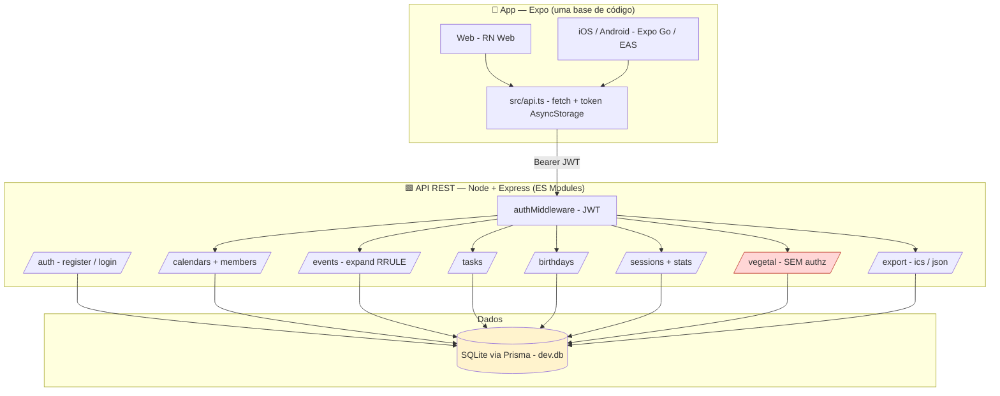
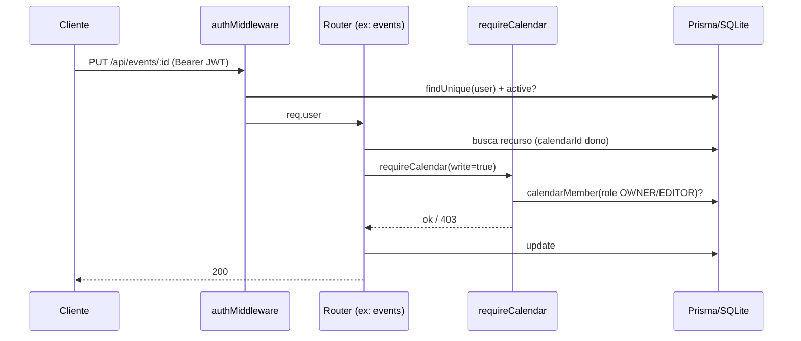

# Avaliação de Arquitetura — Agenda Institucional e Pessoal

> Modo **AVALIAR** · gerado em 2026-06-10 · escopo: `server/` (API Node+Express+Prisma) e `app/` (Expo RN/Web).
> Documento descritivo da arquitetura existente em [ARQUITETURA.md](ARQUITETURA.md); este aqui é o **diagnóstico crítico**.

## Resumo executivo

O projeto é um monolito modular bem organizado para o estágio em que está: uma única base de código serve iOS, Android e Web (Expo), e a API REST expõe módulos isolados por router. O padrão de cada módulo é consistente e fácil de estender — a promessa de "novo módulo = novo model + novo router + nova tela" se sustenta no código real.

A dívida técnica está concentrada em três frentes: **segurança/autorização** (um módulo sem qualquer checagem de acesso, JWT_SECRET com fallback inseguro, sem rate limiting), **operação** (sem migrations versionadas, sem testes, logging só com `console`), e **escala futura** (listagens sem paginação e estatísticas calculadas em memória). Nada disso bloqueia o uso atual — institucional, poucos usuários — mas cada item vira risco real assim que o sistema for publicado ou ganhar volume.

A nota geral é **3.0/5**: base sólida e limpa, com lacunas claras e baratas de fechar antes de produção.

---

## A. Mapa do estado atual

Fluxo de autorização de escrita (onde existe) — centralizado e correto:

---

## B. Score de qualidade arquitetural

| Dimensão | Nota | Observação |
|----------|------|-----------|
| Manutenibilidade | 4/5 | Routers isolados, padrão repetido e previsível, `requireCalendar` centraliza autorização. Server em JS puro (sem tipos) e validação manual repetida puxam pra baixo. |
| Escalabilidade | 3/5 | SQLite + `db push` ok p/ uso institucional. `findMany` sem paginação e `/sessions/stats` somando tudo em memória viram gargalo com histórico grande. |
| Observabilidade | 1/5 | Só `console.error` no handler global. Sem logs estruturados, sem request id, sem métricas, sem healthcheck de dependências. Debugar em produção seria às cegas. |
| Segurança | 2/5 | bcrypt + JWT corretos, mas: `/vegetal` sem autorização, `JWT_SECRET` com fallback hardcoded, sem rate limiting no login, CORS totalmente aberto, sem validação de schema. |
| Testabilidade | 2/5 | Zero testes. Lógica acoplada ao `req/res` e ao Prisma global dificulta teste unitário. `expandRecurrences` é pura e testável — bom ponto de partida. |
| Resiliência | 3/5 | App trata erro de fetch e API tem handler global. Sem retries, sem timeouts no cliente, sem validação de entrada que evite 500 por payload malformado. |
| **Total** | **2.5/5** | Base limpa e coesa; segurança e observabilidade são o que separa "protótipo bom" de "pronto pra produção". |

---

## C. Inventário de dívidas técnicas

| # | Problema | Gravidade | Área | Custo |
|---|----------|-----------|------|-------|
| 1 | `/vegetal` (GET/POST/PUT/DELETE) sem `authMiddleware`-scoped check de papel — qualquer usuário autenticado lê e altera o estoque global | 🔴 Alta | Segurança | < 1 dia |
| 2 | `JWT_SECRET` cai em `'dev-secret-trocar-em-producao'` se a env faltar — tokens forjáveis em prod | 🔴 Alta | Segurança | < 1 dia |
| 3 | Sem rate limiting / lockout em `/auth/login` — brute force livre | 🔴 Alta | Segurança | < 1 dia |
| 4 | Sem migrations versionadas (`prisma db push`) — mudanças de schema não rastreadas, risco em deploy | 🔴 Alta | DevOps/BD | 1 dia |
| 5 | CORS aberto a qualquer origem (`cors()` sem config) | 🟡 Média | Segurança | < 1 dia |
| 6 | Sem validação de schema de entrada (papéis, enums, números) — `role` arbitrário em membros, 500 por payload ruim | 🟡 Média | Robustez | 2-3 dias |
| 7 | Zero testes (unit/integração) | 🟡 Média | Qualidade | 5-8 dias |
| 8 | Listagens sem paginação/limite; `/sessions/stats` agrega em memória | 🟡 Média | Escala | 2-3 dias |
| 9 | Sem logging estruturado / métricas / `.env.example` | 🟡 Média | Observabilidade | 1-2 dias |
| 10 | `server-err.txt` / `server-out.txt` versionados; `API_URL` com IP hardcoded no cliente | 🟢 Baixa | Higiene | < 1 dia |

Legenda: 🔴 corrigir antes de produção · 🟡 próximo ciclo · 🟢 backlog

---

## D. Pontos fortes

- **Modularidade real.** Cada domínio é um router independente em `server/src/routes/`; o entrypoint só registra rotas. Estender é trivial e de baixo risco.
- **Autorização centralizada e correta** onde aplicada: `requireCalendar`/`calendarAccess` concentram a regra OWNER/EDITOR/VIEWER + bypass ADMIN num único lugar.
- **Uma base de código → 3 plataformas** via Expo + expo-router, com split `.web.tsx` quando a plataforma exige.
- **Portabilidade de banco** desenhada desde o início (SQLite → PostgreSQL trocando o `provider`, sem mudança de código).
- **Modelagem de domínio madura** no módulo de Sessões e Vegetal — derivada de registros reais, não inventada.
- **`expandRecurrences` é função pura** — fácil de testar e isolada da camada HTTP.
- **Fundamentos de auth corretos**: bcrypt (cost 10) + JWT, primeiro usuário vira ADMIN, usuário inativo bloqueado no login e no middleware.

---

## E. Principais riscos

1. **Exposição do módulo Vegetal.** `vegetal.js` não chama nenhuma verificação de acesso além do `authMiddleware` global. Como `VegetalLote` não pertence a uma agenda, qualquer usuário autenticado — inclusive VISITANTE — pode zerar o estoque. É o gap mais concreto e o mais barato de fechar.

2. **Segredo de assinatura previsível.** Se o deploy esquecer de definir `JWT_SECRET`, o fallback é público (está no código). Qualquer um forja um JWT de ADMIN. O sistema deveria **recusar subir** sem o segredo em produção, em vez de degradar silenciosamente.

3. **Login sem freio.** Sem rate limiting, o endpoint de login é alvo de brute force/credential stuffing. Combinado com senha mínima de 6 caracteres, o espaço de ataque é amplo.

4. **Deploy sem migrations.** `db push` é ótimo em dev e perigoso em prod: não há histórico nem rollback de schema. O primeiro deploy que altere uma coluna com dados reais corre risco de perda.

5. **Cegueira operacional.** Sem logs estruturados nem métricas, o primeiro incidente em produção (lentidão, erro intermitente) não terá trilha para diagnóstico — só `console.error` perdido no stdout.

---

## Recomendação de priorização

> **Atualização 2026-06-10 — Quick wins concluídos:** itens 1, 2, 3, 5, 10 implementados e validados. Role-guard ADMIN/GESTOR no vegetal, `JWT_SECRET` obrigatório (aborta o boot em produção sem ele), rate limit de 10/15min no login (429 confirmado), CORS por allowlist (`CORS_ORIGINS`), `server/.env.example` criado; os `.txt` de saída já estavam no `.gitignore`. Restam os itens 4, 6, 7, 8, 9.

**Antes de qualquer publicação (Quick wins, ~2-3 dias somados):** itens 1, 2, 3, 5, 10 — todos pontuais, alto impacto de segurança, baixo esforço. Adicionar: `requireCalendar`/role-guard no vegetal, exigir `JWT_SECRET` via env (falhar sem ela), `express-rate-limit` no login, CORS allowlist, `.env.example` e remover os `.txt` de saída do versionamento.

**Próximo ciclo (fundação de qualidade):** ~~item 4 (migrations Prisma)~~ ✅ baseline `0_init`; ~~item 6 (validação com Zod)~~ ✅ `lib/schemas.js` em todas as mutações + `express-async-errors`; ~~item 9 (logger — pino)~~ ✅ `lib/logger.js` com pino-http (JSON, req.id, redact); ~~item 7 (primeiros testes)~~ ✅ 24 testes via `node --test` (recorrência, validação, rate limit, guards). **Fundação de qualidade concluída.**

**Quando houver volume:** ~~item 8 (paginação + agregação no banco)~~ ✅ concluído — paginação opt-in (`page`/`pageSize`/`limit`/`offset` + headers `X-Total-Count`/`X-Page`/`X-Page-Size`) em events/tasks/sessions/birthdays sem quebrar o cliente; `/sessions/stats` e total de vegetal agora agregam no banco (`aggregate`/`groupBy`); índices `Task(calendarId,done)` e `Birthday(calendarId)` via migration `add_indexes_task_birthday`.

> Com isso, todos os itens 1–10 do inventário de dívidas técnicas estão endereçados, exceto evoluções incrementais (mais testes de integração, cobertura, e adoção da paginação no app).

---

## Gaps de documentação a converter em specs

A próxima etapa estrutura o projeto em **specs SDD** (via skill `sdd-spec`), uma por módulo de domínio + as specs transversais de segurança e operação que hoje não têm documento próprio:

| Spec | Por que precisa | Origem |
|------|-----------------|--------|
| Autenticação & Autorização | Regra de acesso é o núcleo de segurança e está só no código | `auth.js`, `requireCalendar` |
| Agendas & Compartilhamento | Modelo de papéis OWNER/EDITOR/VIEWER multi-tenant | `calendars.js` |
| Eventos & Recorrência | RRULE é subconjunto próprio, precisa contrato explícito | `events.js`, `recurrence.js` |
| Tarefas | CRUD simples, formalizar regras | `tasks.js` |
| Aniversários & Classificação etária | Regra de faixa etária calculada na API | `birthdays.js` |
| Controle de Sessões | Domínio institucional central | `sessions.js`, MODULO-SESSOES.md |
| Estoque de Vegetal | **Tem o gap de autorização** — spec define o comportamento correto | `vegetal.js` |
| Exportação & Backup | Contrato ICS/JSON e import | `export.js` |
| Hardening de Segurança & Operação | Transversal: secret, rate limit, CORS, logs, migrations | (novo) |
