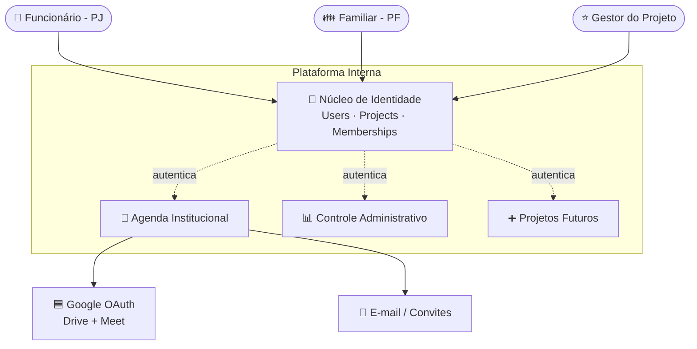
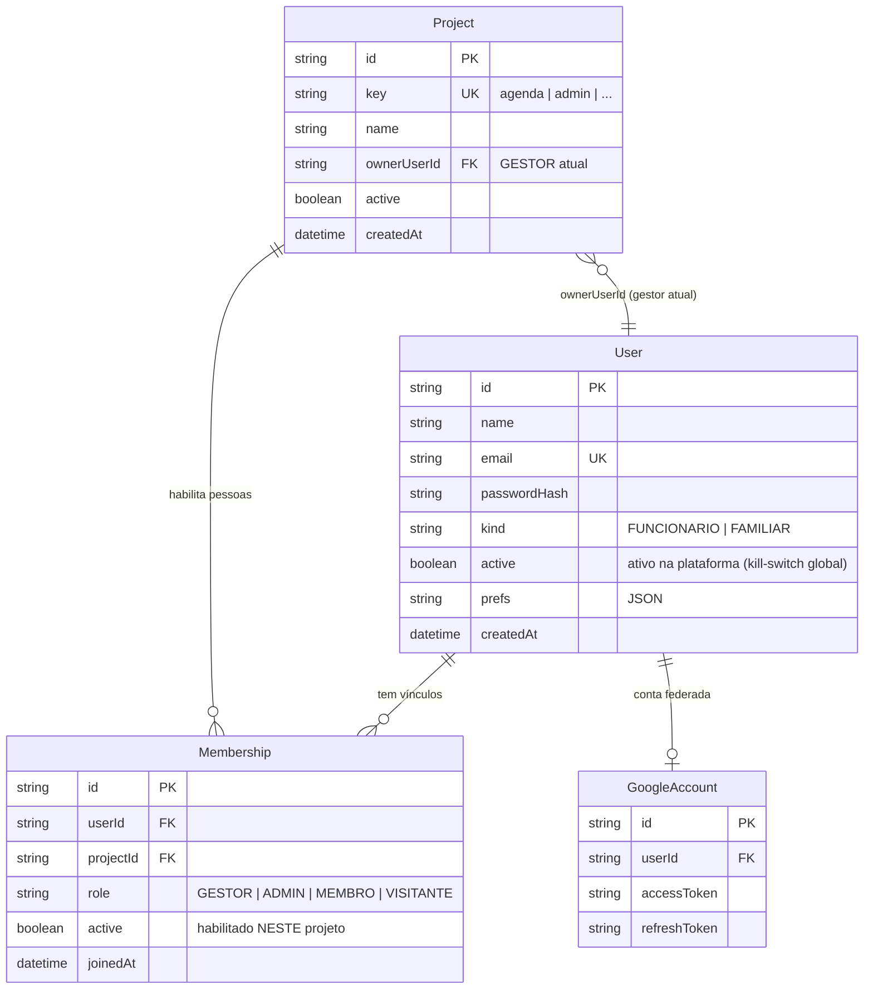
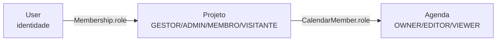
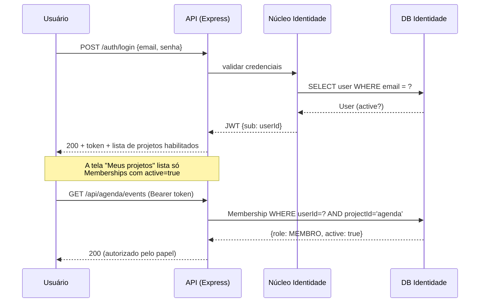
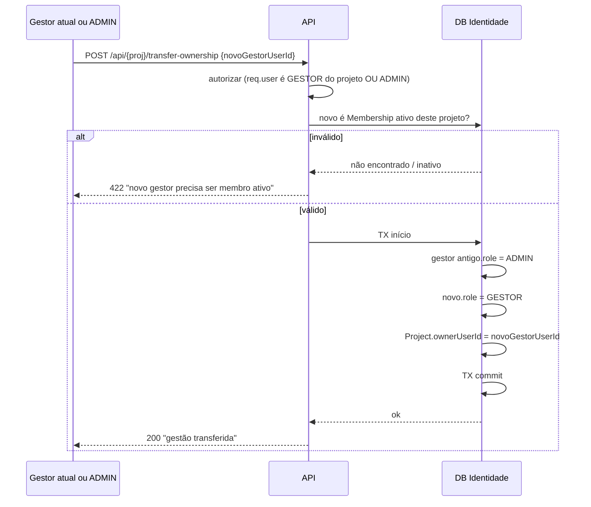
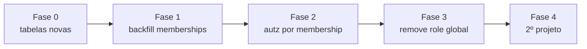

# Arquitetura — Identidade Central Compartilhada (multi-projeto)

> Documento de arquitetura. Define como Agenda Institucional, Controle Administrativo
> e projetos futuros compartilham uma **base única de usuários**, habilitando cada
> pessoa por projeto e com papel próprio em cada um. Stack: Express + Prisma.
> Status: proposta aprovada (topologia "banco de identidade central"). Pré-implementação.

---

## 1. Visão Geral

Hoje cada projeto teria seu próprio cadastro de usuários, duplicando pessoas e senhas. A empresa, porém, tem **um conjunto único de pessoas** — funcionários (PJ) e familiares (pessoa física) — que circulam por vários sistemas internos com mais ou menos acesso conforme a necessidade. A proposta é separar **quem a pessoa é** (identidade) de **o que ela pode fazer em cada projeto** (vínculo + papel).

Adotamos um **banco de identidade central** (modelo SSO): um único banco guarda `User`, `Project` e `Membership`. Cada projeto continua dono dos seus próprios dados de domínio (eventos, sessões, controle administrativo) e apenas **referencia o `userId` central**. Um login serve todos os projetos; habilitar alguém num projeto novo é criar um `Membership`, não recadastrar a pessoa.

A regra do **Gestor** — o primeiro usuário institucional de cada projeto, imutável exceto por transferência — deixa de ser um papel global e passa a ser uma propriedade **por projeto**, ancorada em `Project.ownerUserId` e protegida na camada de regra de negócio.

---

## 2. Requisitos Arquiteturais

| Requisito | Tipo | Prioridade | Notas |
|-----------|------|------------|-------|
| Base única de usuários reaproveitada entre projetos | Funcional | Alta | Uma conta = uma pessoa |
| Habilitar/desabilitar usuário **por projeto** | Funcional | Alta | `Membership.active` |
| Papel por projeto (não global) | Funcional | Alta | GESTOR/ADMIN/MEMBRO/VISITANTE no `Membership` |
| Distinção funcionário (PJ) vs familiar (PF) | Funcional | Média | `User.kind` |
| Gestor imutável, exceto transferência ou ADMIN | Funcional | Alta | Trava de negócio sobre `Project.ownerUserId` |
| Cada projeto com gestor independente | Funcional | Alta | 1 owner por `Project` |
| Login único serve todos os projetos | Não-funcional | Alta | JWT central + projeto ativo |
| Autorização por rota baseada em membership | Não-funcional | Alta | Middleware `requireMembership(role)` |
| Não quebrar dados de agenda já existentes | Não-funcional | Alta | Migração incremental, sem perda |
| Portar de SQLite (dev) para PostgreSQL (prod) | Não-funcional | Média | Provider Prisma trocável |

---

## 3. Estilo Arquitetural Recomendado

**Monolito modular com núcleo de identidade compartilhado**, banco central de identidade + esquemas (ou bancos) de domínio por projeto.

Por quê: o time é pequeno e a stack já é Express + Prisma. Microsserviço de auth dedicado (com token server próprio) seria robusto, mas adiciona deploy, rede e sincronização que não se pagam com poucos projetos. O monolito modular entrega o ganho central — **uma identidade, N projetos** — sem overhead operacional. A camada de identidade fica isolada o suficiente para, no futuro, virar um serviço próprio caso o número de projetos cresça.

| Opção descartada | Por que não agora |
|------------------|-------------------|
| Microsserviço de auth + bancos 100% separados | Overhead de rede/deploy/observabilidade alto demais para poucos projetos e time enxuto |
| Tudo num banco monolítico (dados de todos os projetos juntos) | Acopla domínios distintos; dificulta backup/escala por projeto e isolamento de dados |
| Manter `role` global no `User` | Impede o mesmo usuário ter papéis diferentes por projeto — é exatamente o requisito central |

### Decisão de dados: identidade central, domínio por projeto

- **Banco `identity`** (central): `User`, `Project`, `Membership`, e contas federadas como `GoogleAccount`.
- **Dados de domínio por projeto**: cada projeto referencia `userId` do banco central. Em PostgreSQL isso pode ser **um schema por projeto** no mesmo cluster (ex.: `agenda.*`, `admin.*`) ou bancos separados. Em dev (SQLite) começamos com tudo num arquivo, mas com a fronteira lógica já desenhada (tabelas de identidade vs. tabelas de domínio).

> Importante: com bancos/schemas separados não há FK física cruzando a fronteira de identidade → domínio. A integridade do `userId` é garantida na aplicação (o usuário é resolvido pelo JWT antes de qualquer escrita). Por isso o `userId` é tratado como uma referência estável e imutável (`cuid`).

---

## 4. Diagrama de Contexto



A pessoa autentica **uma vez** no núcleo de identidade e, a partir do projeto ativo, acessa o app correspondente. Cada app valida o acesso pelo `Membership` daquela pessoa naquele projeto.

---

## 5. Modelo de Dados

### 5.1 Núcleo de identidade (banco central)



**Mudança-chave:** o campo `role` **sai do `User`** e passa a viver no `Membership`. O `User` agora só responde "quem é a pessoa"; o `Membership` responde "o que ela é em cada projeto".

Restrição de unicidade: `@@unique([userId, projectId])` no `Membership` — uma pessoa tem no máximo um vínculo por projeto.

### 5.2 Schema Prisma proposto (trecho do núcleo)

```prisma
model User {
  id           String   @id @default(cuid())
  name         String
  email        String   @unique
  passwordHash String
  // FUNCIONARIO (PJ) | FAMILIAR (pessoa física)
  kind         String   @default("FUNCIONARIO")
  // Kill-switch global da plataforma (raramente usado; o controle fino é por projeto).
  active       Boolean  @default(true)
  prefs        String?
  createdAt    DateTime @default(now())

  memberships   Membership[]
  ownedProjects Project[]  @relation("ProjectOwner")
  google        GoogleAccount?
  // relações de domínio (events, tasks, sessions...) permanecem por userId
}

model Project {
  id          String   @id @default(cuid())
  // identificador estável usado no app/JWT: "agenda", "admin", ...
  key         String   @unique
  name        String
  // GESTOR atual do projeto. Imutável exceto por transferência/ADMIN (ver §7).
  ownerUserId String
  active      Boolean  @default(true)
  createdAt   DateTime @default(now())

  owner       User         @relation("ProjectOwner", fields: [ownerUserId], references: [id])
  memberships Membership[]
}

model Membership {
  id        String   @id @default(cuid())
  userId    String
  projectId String
  // GESTOR | ADMIN | MEMBRO | VISITANTE — papel NESTE projeto
  role      String   @default("MEMBRO")
  // Habilitado/desabilitado neste projeto, sem apagar a conta nem o histórico.
  active    Boolean  @default(true)
  joinedAt  DateTime @default(now())

  user      User    @relation(fields: [userId], references: [id], onDelete: Cascade)
  project   Project @relation(fields: [projectId], references: [id], onDelete: Cascade)

  @@unique([userId, projectId])
  @@index([projectId, role])
}
```

> `CalendarMember` (OWNER/EDITOR/VIEWER por agenda) **permanece** — ele é um nível ainda mais fino, dentro do projeto Agenda. A hierarquia fica: **Plataforma → Projeto (Membership) → Recurso/Agenda (CalendarMember)**.

### 5.3 Hierarquia de autorização (3 níveis)



---

## 6. Fluxo de Autenticação e Autorização Multi-projeto

### 6.1 O que o JWT carrega

O token de sessão identifica a **pessoa**, não o papel. O papel é resolvido por projeto a cada requisição (ou cacheado por curto período). O **projeto ativo** entra no fluxo de uma destas formas:

- **Recomendado:** o `projectId` (ou `key`) viaja no **path da API** (`/api/agenda/...`, `/api/admin/...`) ou num header `X-Project`. O JWT permanece o mesmo para todos os projetos.
- O JWT guarda só `sub` (userId) e dados estáveis; **nunca** o papel (que muda e pode ser revogado a qualquer momento).

```
JWT payload = { sub: userId, name, iat, exp }   // sem role, sem projeto fixo
```

### 6.2 Login e seleção de projeto



No login a API devolve a lista de **projetos habilitados** (apenas `Membership.active = true` e `Project.active = true`), que vira o seletor de projeto da interface.

### 6.3 Middleware de autorização por membership

```js
// resolve o vínculo da pessoa no projeto da rota e aplica o papel mínimo exigido
function requireMembership(minRole) {
  const ORDER = { VISITANTE: 0, MEMBRO: 1, ADMIN: 2, GESTOR: 3 };
  return async (req, res, next) => {
    const userId = req.user.sub;                 // do JWT
    const projectId = req.projectId;             // do path/header
    const m = await prisma.membership.findUnique({
      where: { userId_projectId: { userId, projectId } },
    });
    if (!m || !m.active) return res.status(403).json({ error: 'sem acesso a este projeto' });
    if (ORDER[m.role] < ORDER[minRole]) return res.status(403).json({ error: 'papel insuficiente' });
    req.membership = m;
    next();
  };
}

// uso:  router.delete('/users/:id', requireMembership('ADMIN'), handler)
```

Desabilitar alguém num projeto (`Membership.active = false`) corta o acesso **na próxima requisição** — não depende de expirar o JWT, porque o papel é checado no banco a cada chamada autorizada.

---

## 7. Regra de Negócio do Gestor

O **Gestor** de um projeto é o primeiro usuário institucional vinculado àquele projeto. Modelado em dois lugares que devem permanecer consistentes:

- `Project.ownerUserId` → aponta para o gestor **atual**.
- O `Membership` correspondente tem `role = 'GESTOR'`.

### 7.1 Invariantes (garantidas na camada de serviço, não só no schema)

1. **Todo projeto tem exatamente um GESTOR ativo** a qualquer momento.
2. O `Membership` do gestor **não pode** ser rebaixado, desativado (`active=false`) nem removido por uma operação comum.
3. O gestor só muda por **transferência explícita** (o próprio gestor passa o bastão) **ou** por ação de um **ADMIN**.
4. Ao criar o projeto, o **primeiro usuário** vira o gestor automaticamente (`ownerUserId` = ele; `Membership.role = GESTOR`).

### 7.2 Transferência de gestão (operação atômica)



Pontos de implementação:
- A troca é uma **transação única** (`prisma.$transaction`) para nunca ficar com dois gestores ou nenhum.
- O gestor antigo é rebaixado para **ADMIN** por padrão (mantém acesso forte, mas perde a proteção de owner). Ajustável.
- Guard nas rotas de edição de membership: se o alvo é o gestor atual e a operação não é a de transferência, rejeitar com `409`.

### 7.3 Tabela de permissões por papel

| Ação | VISITANTE | MEMBRO | ADMIN | GESTOR |
|------|:---------:|:------:|:-----:|:------:|
| Ver dados do projeto | ✅ | ✅ | ✅ | ✅ |
| Criar/editar conteúdo próprio | ❌ | ✅ | ✅ | ✅ |
| Habilitar/desabilitar usuários no projeto | ❌ | ❌ | ✅ | ✅ |
| Mudar papel de outros (exceto gestor) | ❌ | ❌ | ✅ | ✅ |
| Transferir gestão | ❌ | ❌ | ✅ | ✅ (sua) |
| Ser rebaixado/removido por outro | ✅ | ✅ | ✅ (por ADMIN/GESTOR) | ❌ (só via transferência) |

---

## 8. Decisões de Tecnologia

| Camada | Tecnologia | Motivo |
|--------|-----------|--------|
| API | Express + Prisma | Stack já em uso; sem reescrita |
| Banco identidade | PostgreSQL (prod) / SQLite (dev) | Provider trocável no Prisma; central e único |
| Dados de domínio | Schemas por projeto no mesmo cluster Postgres | Isolamento lógico sem multiplicar infraestrutura |
| Sessão | JWT (somente `userId`) + checagem de membership no banco | Revogação imediata de acesso por projeto |
| Seleção de projeto | Prefixo de rota `/api/{key}/...` | Simples, explícito, cacheável |

---

## 9. Plano de Migração Incremental

Migração a partir do schema atual (que tem `role` global no `User` e dados de agenda já populados). **Sem perda de dados.** Cada fase é deployável de forma independente.

### Fase 0 — Preparação (sem mudança de comportamento)
- Criar models `Project` e `Membership` no schema; **manter** `User.role` por enquanto (coexistência).
- Migration Prisma aditiva (só cria tabelas; nada destrutivo).
- Critério de sucesso: `prisma migrate` aplica limpo; app continua funcionando com o `role` antigo.

### Fase 1 — Backfill de identidade
- Seed/script: criar o `Project` "agenda" (`key = "agenda"`).
- Para cada `User` existente, criar um `Membership` em "agenda" copiando o papel: `User.role` → `Membership.role` (mapear `GESTOR` global → `GESTOR` do projeto).
- Definir `Project.ownerUserId` = o usuário com `role = GESTOR` mais antigo (`createdAt` mínimo) com e-mail institucional. Se não houver, o primeiro `createdAt`.
- Critério de sucesso: todo usuário ativo tem `Membership` ativo em "agenda"; o projeto tem exatamente um gestor.

### Fase 2 — Cutover da autorização
- Trocar as checagens que leem `req.user.role` por `requireMembership(...)` lendo o `Membership` do projeto da rota.
- Introduzir o prefixo `/api/agenda/...` (ou header `X-Project`) e resolver `req.projectId`.
- Login passa a devolver a lista de projetos habilitados.
- Critério de sucesso: todas as rotas protegidas autorizam por membership; testes de papel (gestor/admin/membro/visitante) passam.

### Fase 3 — Aposentar o `role` global
- Remover `User.role` do schema (migration destrutiva, só após Fase 2 estável em prod).
- Critério de sucesso: nenhum código referencia `user.role`; suíte verde.

### Fase 4 — Onboarding do 2º projeto (Controle Administrativo)
- Criar `Project` "admin"; mover/curar os dados de domínio do controle administrativo para o seu schema.
- Habilitar as pessoas necessárias via `Membership` (reaproveitando os `User` existentes — zero recadastro).
- Critério de sucesso: a mesma conta loga e enxerga "agenda" e/ou "admin" conforme seus memberships.



---

## 10. Riscos e Mitigações

| Risco | Probabilidade | Impacto | Mitigação |
|-------|:------------:|:-------:|-----------|
| Ficar sem gestor (ou com dois) numa transferência | Baixa | Alto | Transação única + invariante validada no serviço |
| `userId` órfão entre bancos/schemas (sem FK física) | Média | Médio | Resolver usuário pelo JWT antes de escrever; nunca aceitar `userId` cru do cliente |
| JWT antigo continuar válido após desabilitar no projeto | Média | Médio | Papel é checado no banco a cada request; `active=false` corta na próxima chamada |
| Backfill mapear gestor errado na Fase 1 | Baixa | Alto | Critério explícito (institucional + `createdAt` mínimo) + revisão manual antes do cutover |
| Acoplar dados de domínio ao banco de identidade por engano | Média | Médio | Fronteira lógica desde o dev; identidade só guarda User/Project/Membership |

---

## 11. Gaps a Definir pelo Time

| Elemento | Por que importa | Sugestão |
|----------|-----------------|----------|
| E-mail "institucional" é validado por domínio? | A regra do gestor cita "e-mail institucional" | Definir lista de domínios aceitos (ex.: `@tri7.com.br`) ou flag por usuário |
| Refresh token / expiração do JWT | Equilíbrio entre UX e revogação | Access token curto (15–60 min) + checagem de membership a cada request |
| Projeto ativo: path vs. header vs. claim | Afeta clientes web/mobile | Recomendado: prefixo de rota `/api/{key}` |
| Familiar (PF) pode ser gestor? | Regra cita "e-mail institucional" para gestor | Provável: só `FUNCIONARIO` pode ser GESTOR — confirmar |
| Onde mora o `prefs` por projeto | Hoje `prefs` é global no User | Avaliar `prefs` por `Membership` se preferências variam por projeto |

---

*Documento gerado pela skill software-architecture. Próximo passo sugerido: implementar a Fase 0 (tabelas `Project`/`Membership`, migration aditiva) sem alterar o comportamento atual.*
